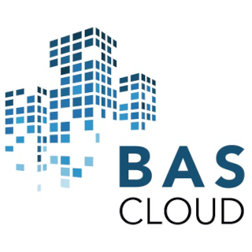

# ioBroker.bascloud

[](https://www.npmjs.com/package/iobroker.bascloud)
[](https://www.npmjs.com/package/iobroker.bascloud)


[](https://nodei.co/npm/iobroker.bascloud/)

**Tests:** 

## BAScloud adapter for ioBroker

BAScloud is a secure platform for networking and storing building information across properties. In addition to historical and current measured values and general information on data points, it stores master data of buildings centrally in a private cloud.

## Developer manual

This section is intended for the developer.

### Scripts in `package.json`

Several npm scripts are predefined for your convenience. You can run them using `npm run <scriptname>`
| Script name | Description |
|-------------|-------------|
| `build` | Compile the TypeScript sources. |
| `watch` | Compile the TypeScript sources and watch for changes. |
| `test:ts` | Executes the tests you defined in `*.test.ts` files. |
| `test:package` | Ensures your `package.json` and `io-package.json` are valid. |
| `test:integration` | Tests the adapter startup with an actual instance of ioBroker. |
| `test` | Performs a minimal test run on package files and your tests. |
| `check` | Performs a type-check on your code (without compiling anything). |
| `lint` | Runs `ESLint` to check your code for formatting errors and potential bugs. |
| `translate` | Translates texts in your adapter to all required languages, see [`@iobroker/adapter-dev`](https://github.com/ioBroker/adapter-dev#manage-translations) for more details. |
| `release` | Creates a new release, see [`@alcalzone/release-script`](https://github.com/AlCalzone/release-script#usage) for more details. |

### Test the adapter manually with dev-server

Since you set up `dev-server`, you can use it to run, test and debug your adapter.

You may start `dev-server` by calling from your dev directory:

```bash
dev-server watch
```

The ioBroker.admin interface will then be available at http://localhost:8081/

Please refer to the [`dev-server` documentation](https://github.com/ioBroker/dev-server#command-line) for more details.

### Test the adapter manually with an actual ioBroker instance

You can also test your adapter in an actual ioBroker instance.

1. Build your adapter:
   ```bash
   npm run build
   ```
2. Run the pack command:
   ```bash
   npm pack
   ```
3. Upload the resulting `iobroker.bascloud-*.tgz` file to your ioBroker instance and install it.
4. Start the adapter in the ioBroker interface.

## Changelog

<!--
	Placeholder for the next version (at the beginning of the line):
	### **WORK IN PROGRESS**
-->

### **WORK IN PROGRESS**

- (Yanick) initial release

## License

MIT License

Copyright (c) 2024 Yanick Stephan <stephan@bascloud.net>

Permission is hereby granted, free of charge, to any person obtaining a copy
of this software and associated documentation files (the "Software"), to deal
in the Software without restriction, including without limitation the rights
to use, copy, modify, merge, publish, distribute, sublicense, and/or sell
copies of the Software, and to permit persons to whom the Software is
furnished to do so, subject to the following conditions:

The above copyright notice and this permission notice shall be included in all
copies or substantial portions of the Software.

THE SOFTWARE IS PROVIDED "AS IS", WITHOUT WARRANTY OF ANY KIND, EXPRESS OR
IMPLIED, INCLUDING BUT NOT LIMITED TO THE WARRANTIES OF MERCHANTABILITY,
FITNESS FOR A PARTICULAR PURPOSE AND NONINFRINGEMENT. IN NO EVENT SHALL THE
AUTHORS OR COPYRIGHT HOLDERS BE LIABLE FOR ANY CLAIM, DAMAGES OR OTHER
LIABILITY, WHETHER IN AN ACTION OF CONTRACT, TORT OR OTHERWISE, ARISING FROM,
OUT OF OR IN CONNECTION WITH THE SOFTWARE OR THE USE OR OTHER DEALINGS IN THE
SOFTWARE.
